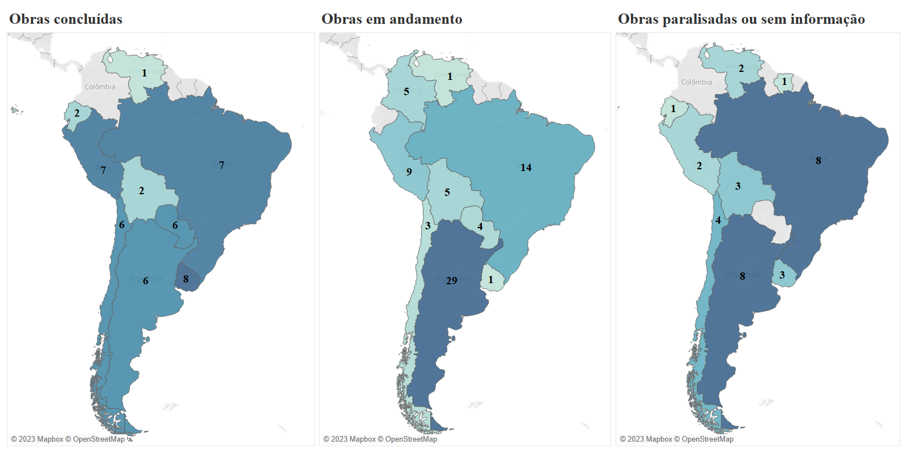

# South-American Regional Infrastructure Data Visualization

Through the use of the Tableau software it was possible to create and develop many different visualizations on the findings of the research, mainly linked to the resilience of the regional infrastructure projects in South-America during a critial juncture for the so called 'post-hegemonic regionalism' and the dismantling of the Union of South-American Nations (UNASUR).

# Research main findings

  Through a data collection (conducted between Feb/2020 and Jan/2023) - in newspapers, ministerial websites and websites of the institutions financing the works in question - it was identified that many of the projects in the IIRSA/COSIPLAN Portfolio continued, many of them being concluded by December 2022 and others still in progress in 2023. Such progress was due, in part, to three main factors: 1. the interests and agency of national actors; 2.the foreign investments coming from extra-regional actors, such as China, the European Union and the United States; and 3. through the resilience of the main institutionality formed through the technical works of the Interamerican Development Bank (IDB), the Development Bank of Latin America (CAF), and the Development Fund for the 'La Plata' Basin (FONPLATA). 

 It is worth mentioning that when evaluating the Project Information System (SIP) on the IIRSA website, by early 2018 there were 165 projects in execution, 83 projects in the profile stage, and 154 projects in pre-execution. Projects already running were selected to assess their continuity and/or stoppage after the end of Unasur. Of the 165 projects in progress, 50 were completed between 2018 and January/2023, 82 are still running, 20 are paralyzed and 13 it was not possible to find information about their status.

 <b></b>Graphic 1 - Works from the IIRSA/COSIPLAN Portfolio by status (completed, in progress, paralyzed or without information) between 2018 and Jan./2023. </b>

