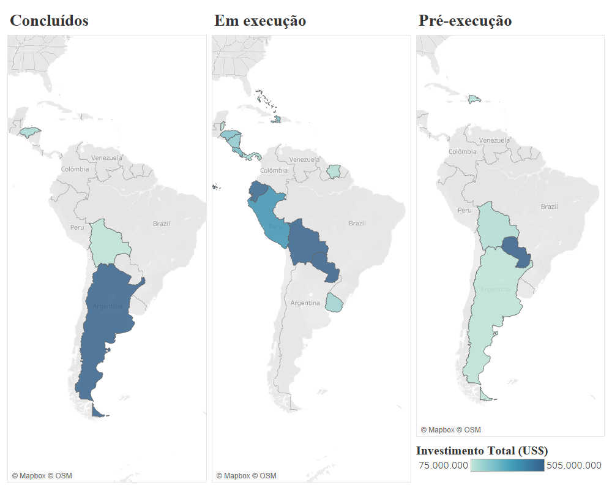
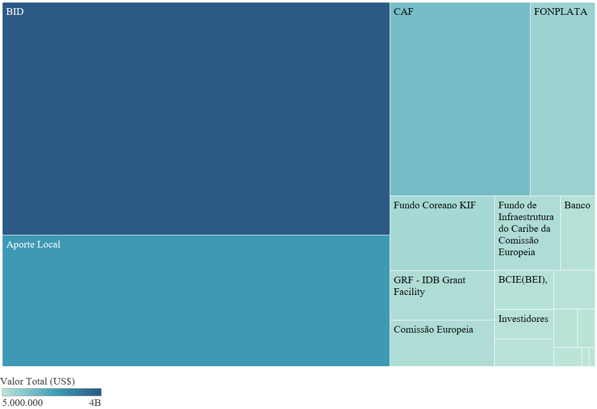

# South-American Regional Infrastructure Data Visualization

Through the use of the Tableau software it was possible to create and develop many different visualizations on the findings of the research, mainly linked to the resilience of the regional infrastructure projects in South-America during a critial juncture for the so called 'post-hegemonic regionalism' and the dismantling of the Union of South-American Nations (UNASUR).

# Research main findings

  Through a data collection (conducted between Feb/2020 and Jan/2023) - in newspapers, ministerial websites and websites of the institutions financing the works in question - it was identified that many of the projects in the IIRSA/COSIPLAN Portfolio continued, many of them being concluded by December 2022 and others still in progress in 2023. Such progress was due, in part, to three main factors: 1. the interests and agency of national actors; 2.the foreign investments coming from extra-regional actors, such as China, the European Union and the United States; and 3. through the resilience of the main institutionality formed through the technical works of the Interamerican Development Bank (IDB), the Development Bank of Latin America (CAF), and the Development Fund for the 'La Plata' Basin (FONPLATA). 

 It is worth mentioning that when evaluating the Project Information System (SIP) on the IIRSA website, by early 2018 there were 165 projects in execution, 83 projects in the profile stage, and 154 projects in pre-execution. Projects already running were selected to assess their continuity and/or stoppage after the end of Unasur. Of the 165 projects in progress, 50 were completed between 2018 and January/2023, 82 are still running, 20 are paralyzed and 13 it was not possible to find information about their status.

 <b>Graphic 1 - Works from the IIRSA/COSIPLAN Portfolio by status (completed, in progress, paralyzed or without information) between 2018 and Jan./2023. </b>

 Despite the dismantling of UNASUR, the demand for a better and conecting infrastructure was still present and growing within the continent. Without a common space to cooperate, share challenges, ideas and to promote common goals, the three main multilateral finance institutions that supported the IIRSA/COSIPLAN initiatives - BID, CAF and FONPLATA, decided to launch their own initiative: <b> the Alliance for the Integration and Development of Latin America and the Caribbean (ILAT).</b> 

 Proposing to create a space for continuity and cooperation for infraestructure development, these institutions also tried to promote a space not so dependent on the stability and will of national governments, expanding their contributions to Latin American and Caribbean Countries.

 Looking at the ILAT Alliance project portfolio, there is a total of 53 projects, of which, by February 2023: 5 were already concluded, 39 in execution, 8 in pre-execution, and 1 in the profile stage. Of these 53 projects, it is estimated that more than US$8 billion will be invested. 

 <b>Graphic 1 - Works from the IIRSA/COSIPLAN Portfolio by status (completed, in progress, paralyzed or without information) between 2018 and Jan./2023. </b>

 Of the 5 completed works, 2 were in Argentina, both related to the ongoing works of the IIRSA/COSIPLAN Portfolio, specifically on National Route Nº. 40, and the reactivation and improvement of the Belgrano Cargo Railroad in the country. Of the works in progress Bolivia (10 works), Paraguay (5 works) and Ecuador (5 works) stand out, with a total investment of: US$835,913,967.0; US$849,081,151.00 and US$806,844,000.00, respectively. Of the 8 works in pre-execution, they are: Paraguay (4), Bolivia (2), Argentina (1) and Dominican Republic (1) and, finally, the only work in the study stage (profile) is the electrical interconnection between Ecuador and Peru, with an expected investment amount of US$280 million, to be financed by the IDB and local sources in both countries. 

 <b>Graphic 1 - Works from the IIRSA/COSIPLAN Portfolio by status (completed, in progress, paralyzed or without information) between 2018 and Jan./2023. </b>

 Relying on financial support from the IDB, CAF and FONPLATA, the ILAT Alliance also relies on co-financing from other agencies, including the European Development Bank and the European Commission, the Japan International Cooperation Agency (JICA) and the Korean KIF background (Image 9 and Table 2). 

 It is important to note that the work of the IDB, CAF and FONPLATA continued by giving support to the demands that were still present in the continent and, even though there is no stable and permanent regional institutionality in which support from these financial organizations can be channeled to regional integration, other ways have been found to do so.

